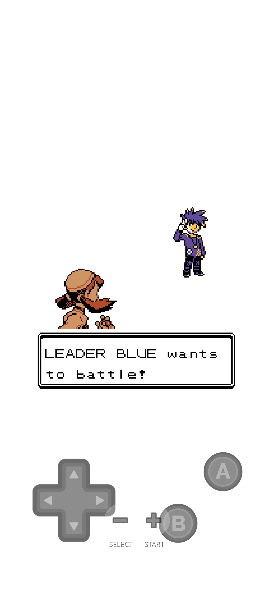
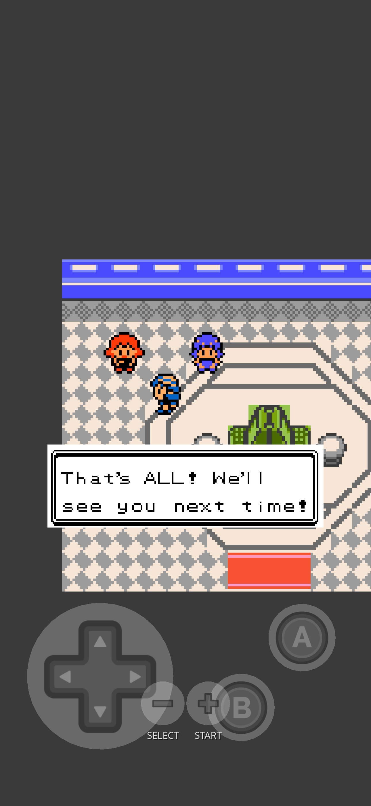

# Indigo Plateau Conference

A tournament circuit for **Pokémon Gold**, built on
[gen1recomp](https://github.com/bryanthaboi/gen1recomp).

Upstairs in every Pokémon Center there's a battle room nobody uses — the
link-battle room single player never sees. The Colosseum circuit fills it.
Climb the stairs in Violet and you've walked into the Violet Qualifier; do
it in Blackthorn and it's the Masters. Four rounds, one challenger each, a
different field every time, ending at the Indigo Plateau Conference itself.

> **Playable end to end.** All five events run, and the roster is complete.
> Bug reports and ideas are welcome in [GitHub Issues](../../issues) —
> please include the version from the load banner and which other mods you
> had enabled.

Want to know who's in the pool, or how the levels are decided? Open the
**[FAQ and spoiler guide](FAQ.md)** — every answer is collapsed, so you
only reveal what you want to know.

| | |
| --- | --- |
|  |  |
| Challengers fight under their own names. | The announcer sees you out after the final round. |

## The circuit

Five events, one per town. Which one you get is decided by whose stairs you
climbed — the mod adds no maps, no warps and no new buildings.

| Event | Climb the stairs in | To enter |
| --- | --- | --- |
| Violet Qualifier | Violet City | the Zephyr Badge |
| Goldenrod Open | Goldenrod City | 3 Johto badges |
| Ecruteak Invitational | Ecruteak City | 4 Johto badges |
| Blackthorn Masters | Blackthorn City | 8 Johto badges |
| Indigo Plateau Conference | Indigo Plateau | beat the Elite Four |

Only **Johto** badges count. The host tells you what's missing, and being
turned away costs nothing — a tournament you have running somewhere else is
left alone.

**Difficulty is fixed per venue, not scaled to you.** Each event is
anchored to that town's own gym leader — a step above the gym, climbing
again with every round. So the Violet Qualifier is an early-game
tournament no matter when you walk into it, and clearing the Blackthorn
Masters means something specific. The anchor is read from the game's own
trainer data rather than written down in the mod, so it stays honest if
anything rebalances.

## How a run works

- **Four rounds**, one challenger each.
- **Win all four** and the title is yours, with a send-off from the
  announcer.
- **Lose any round and you're eliminated** — back to round one with a
  brand-new field of challengers. Losing here is not a blackout: you don't
  lose money and you aren't sent to a Pokémon Center. Your team is patched
  up where it stands. PP is *not* restored, so a fresh run is never free.
- **It's repeatable.** Take a title and you can enter again; the announcer
  draws a new card.
- **A run in progress survives quitting.** The bracket travels with your
  in-game save, so loading an older save rewinds the tournament with it.

**Every run fields a different card.** The roster is 39 challengers across
four escalating tiers, and each run draws one per tier. A new draw never
repeats the previous run's pick in a tier, so back-to-back tournaments
always look different. Challengers speak for themselves — an introduction
on the way in, a parting line on the way out — and they battle under their
own names.

## Options

One option, on the mod's own options screen.

| Option | Default | What it does |
| --- | --- | --- |
| Diagnostic rows | **Off** | Prints what the mod is doing to the mod manager's `[ERRS]` screen |

Leave it off for normal play. **Turn it on if you're reporting a bug** —
it's the only way to see what happened, since there's no console on a
phone. See the [FAQ](FAQ.md) for what to send.

> There is an engine-wide bug (not specific to this mod) where an option
> changed during a Gold game may not be remembered on restart. If a toggle
> doesn't stick, that's why.

## Installation

1. Download the zip from the
   [latest release](../../releases/latest).
2. In the launcher: **MODS → Import mod .zip**. On iOS, delete any older
   copy of the zip from Files first.
3. Fully quit and relaunch.

Requires gen1recomp **0.1.78 or newer**. No engine changes and no
companion mods are needed.

After installing an update, **fully quit and relaunch**. The load banner
prints the running version, so you can confirm what's actually live.

## Compatibility

**Pokémon Gold only.** Not Red, Blue or Yellow, and not Crystal. On other
games the mod simply doesn't load.

- **It sits quietly beside other mods.** It ships no maps, tilesets or
  warps, and changes no vanilla NPC, script or trainer. Everything it
  places in the Colosseum is a runtime object, which never enters the
  map-data merge — so no other mod's map patch can clobber it, and it
  clobbers nothing.
- **Ordinary trainers out in Johto are unaffected.** Tournament teams
  apply only inside the tournament.
- **[Ribbons](https://github.com/mistermiracle3036/Ribbons)** — optional,
  and **planned rather than working today**. Winning a title is already
  recorded on every Pokémon in your party, whether or not you have Ribbons
  installed. A Conference ribbon in that mod will read the record when it
  ships. Because the record lives on the Pokémon, it applies backwards:
  tournaments you've already won will count, and you can install Ribbons
  later without redoing anything.

## Credits

By **Mister Miracle**
([@mistermiracle3036](https://github.com/mistermiracle3036)).

- **This mod ships no art of its own.** Every character on screen wears a
  sprite already in the Gold ROM, referenced by its id — nothing is copied
  out of the game and redistributed here.
- The owned-NPC pattern this mod uses on Gold was proven first in **Court
  of Noctowl**.
- Built on the [gen1recomp](https://github.com/bryanthaboi/gen1recomp)
  engine, with reference to the [pret](https://github.com/pret)
  disassembly research.
- Additional character art, as and when it arrives, is credited in
  [CREDITS.md](CREDITS.md).

Pokémon and Pokémon character names are trademarks of Nintendo, Creatures
Inc. and GAME FREAK inc. This is an unofficial fan project, not affiliated
with or endorsed by any of them.

Licensed under [MIT](LICENSE) — the licence covers this mod's own code and
art, not ROM-derived material or the trademarks above. See
[THIRD_PARTY_NOTICES.md](THIRD_PARTY_NOTICES.md).
